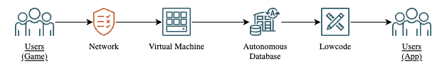
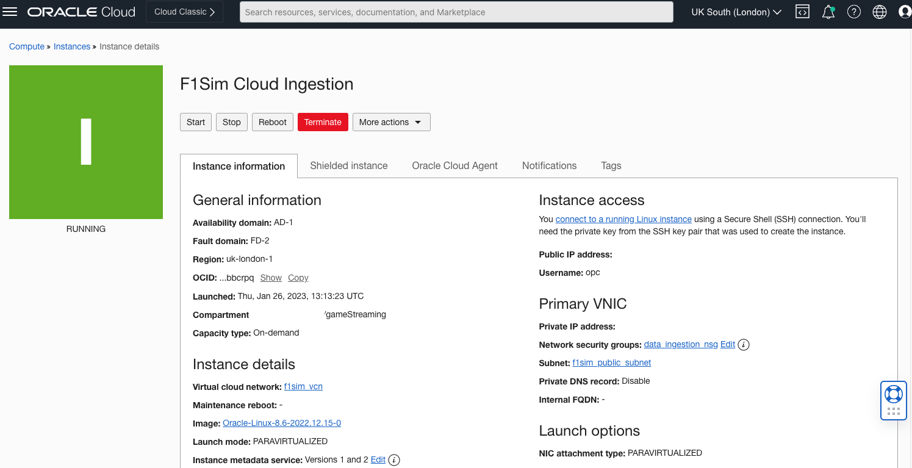
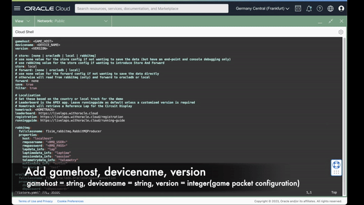
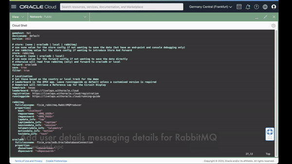
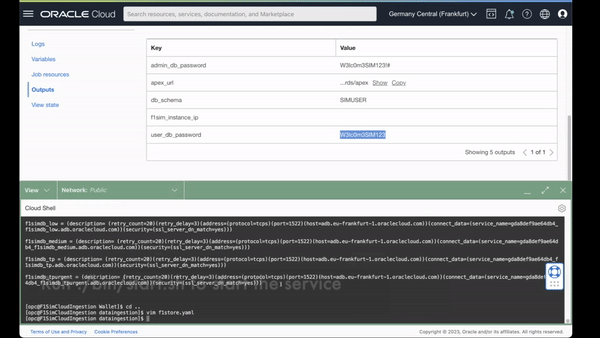

# Data Ingestion Setup

## Introduction

In this section we will review Data Ingestion application that was deployed with "Resource Manager" in previous lab. Optionally you can run Data Ingestion locally on an edge devices like Raspberry Pi.

Estimated Lab Time: 10 minutes

### Objectives

In this workshop, you will learn about:
* F1 data packets high level flow
* Local Data Ingestion setup guide

### Prerequisites
This lab assumes you have:
* An Oracle Cloud account
* All previous labs successfully completed
* (Optional) Edge device like Raspberry Pi

### Data Flow
  

### Data Flow 
For latest packet definition please visit [here](https://racinggames.gg/f1/f1-22-update-117-patch-notes/)

## Task 1: Log to your VM via SSH

1. In Cloud Console navigate to Instance and Compute
2. Check IP address
    
3. Log using cloud shell or any other ssh client
4. Run `$F1SIM_HOME/bin/install_di.sh`
5. Input your Python version i.e. `3.9`
6. Input your RabbitMQ login and password (we will need them later)
7. Duplicate f1store.yaml.template - `cp f1store.yaml.template f1store.yaml`
8. Configure f1store.yaml with text editor like vim or nano - `vim f1store.yaml`
9. Add following to your .yaml config file:
   1.  _gamehost_ - string
   2.  _devicename_ - string
   3.  version - integer game packet configuration
     
   1.  Messaging details for RabbitMQ _rmqusername_, _rmqpassword_
     
   1.  _dbusername_ - from your stack
   2.  _dbpassword_ - from your stack 
   3.  _dburl_ in Cloud Shell Run `cat Wallet/tnsnames.ora`
     
10. Run `./bin/start.sh` to start services
    

## (Optional)Task 2: Setting up Edge Device

### Prerequisites
- Edge device with aarch64 OS architecture
- Autonomous Database provisioned and associated wallet file
- Oracle Instant Client installation
- Python 3+ (Tested with Python 3.8)
- Raspberry Pi 3/4/400 with Raspbian 64bits flashed on a 32Gb micro-sd card
- RabbitMQ (if Store And Forward is preferred)
- Linux-based (as the scripts have been run with Ubuntu / Oracle Linux)

#### Installing 64bit OS on Rasperry Pi:
   1. Download Raspberry  [PI Imager](https://www.raspberrypi.com/software/) and install it locally 
   1. Download the [aarch64 OS image](https://downloads.raspberrypi.org/raspios_arm64/images/raspios_arm64-2022-09-26/2022-09-22-raspios-bullseye-arm64.img.xz)
   1. Attach the SD Card to the your machine to image.
   1. Start the PI Imager
   1. Choose OS with "Use Custom OS" and select the downloaded image.
   1. Choose Storage and select the SD Card
   1. Configure Advanced Options
   1. Setup name of your device
   1. Setup username as "oracle"
   1. Set password
   1. Enable SSH
   1. Enable WIFI
   1. Set Locale
   1. Save and Write Image to SD Card

#### Installing Data Ingestion Application:
1. SSH into your Raspberry Pi or 
1. Git clone Data Ingestion engine to your Raspberry Pi from: https://git.opcvr.tech/esports/dataingestion
2. Checkout to Pi Branch
3. Download wallet (eg _Wallet_ATP.zip_) and copy wallet zip file into $F1SIM_HOME
4. Run $F1SIM_HOME/bin/install_pi.sh
5. Input _rmqusername_ amd _rmqpassword_ - we will need them later
6. Copy $F1SIM_HOME/f1store.yaml.template as $F1SIM_HOME/f1store.yaml
7. Update f1store.yaml with Autonomous Database details from lab 1
  - (Optional) Adjust _gamehost_ parameter for your host
  - (Optional) _device_ parameter to your device name
  - (Optional) _store_ parameter to how you want to process / save the data
   - Update _rmqusername_ from step 4
   - Update _rmqpassword_ from step 4

#### Running services with webUI
Navigate to <raspberrypi IP address> in web browser or open localhost

#### Running services with CLI
SSH to you Pi or open terminal on your raspberry pi

1. To start UDP listener execute in terminal  
`sudo systemctl start f1sim-producer`

1. To start a Rabbit MQ consumer  
`sudo systemctl start f1sim-consumer`

1. To start a flask-based web application to support the running of the F1 Simulator  
`sudo systemctl start f1sim-webserver`

To Monitor and Manage RabbitMQ use following commands  
   `sudo rabbitmqctl list_queues` - to see how many messages on the _PacketData_ queue  
   `sudo rabbitmqctl purge_queue PacketData` - to delete messages on the _PacketData_ queue  
Or connect to http://localhost:15672 (or remotely via the Pi's IP address), use your RMQ username / password to log into the management console